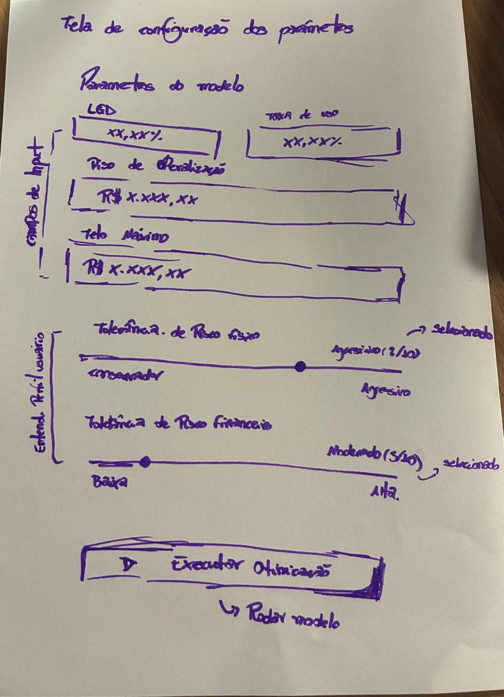
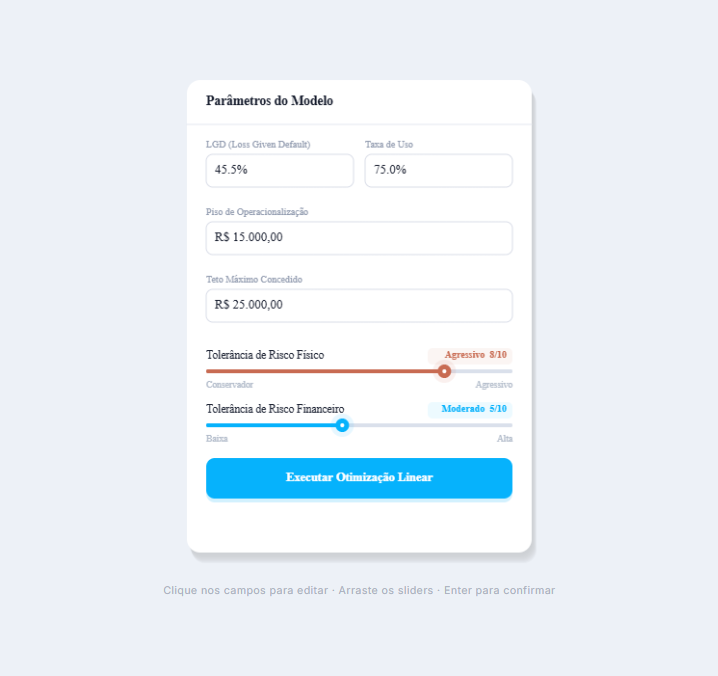

# Microinterface — Parâmetros do Modelo

## 1. Introdução à Proposta

Esta microinterface foi criada em **p5.js** como protótipo visual exploratório de um painel de controle de parâmetros para um sistema de crédito com análise de risco.

A proposta replica e anima o card de "Parâmetros do Modelo" presente no projeto, tornando-o completamente interativo e funcional. O objetivo é ajudar o usuário a **compreender e controlar** os principais parâmetros do algoritmo de decisão:

| Parâmetro | Descrição |
|---|---|
| **LGD (Loss Given Default)** | Percentual de perda estimada em caso de inadimplência |
| **Taxa de Uso** | Taxa de utilização do limite de crédito |
| **Piso de Operacionalização** | Valor mínimo de crédito concedido pelo sistema |
| **Teto Máximo Concedido** | Valor máximo de crédito que o sistema pode liberar |
| **Tolerância de Risco Físico** | Nível de aceitação de risco físico (1–10) |
| **Tolerância de Risco Financeiro** | Nível de aceitação de risco financeiro (1–10) |

### Interações disponíveis

- **Campos de texto editáveis** — clique em qualquer campo numérico, digite o novo valor e pressione `Enter` para confirmar (ou `Esc` para cancelar).
- **Sliders arrastáveis** — arraste os controles deslizantes de tolerância de risco para ajustar os valores de 1 a 10 em tempo real.
- **Botão "Executar Otimização Linear"** — ao clicar, dispara uma animação de progresso que simula o processamento do algoritmo.


## 2. Rascunhos Iniciais





## 3. Registro do Resultado Obtido

A interface final reproduz fielmente o card da imagem de referência:

- **Card branco** com sombra suave sobre fundo cinza claro
- **Header** título "Parâmetros do Modelo"
- **4 campos de entrada** com labels, valores formatados (% e R$) e borda azul ao focar
- **2 sliders** com track bicolor, thumb com glow e rótulos dinâmicos ("Agressivo 8/10", "Moderado 5/10")
- **Botão azul** com texto "Executar Otimização Linear" e animação de preenchimento ao executar

### Screenshot do resultado




---

## Como executar

1. Abra o arquivo `index.html` em qualquer navegador moderno (Chrome, Firefox, Edge).
2. Nenhuma instalação adicional é necessária — a biblioteca p5.js é carregada via CDN.

```
projeto/
├── index.html   
├── carolinePaz.js   
└── README.md   
```

